# telegram-voice

Bidirectional voice bridge between Telegram (MTProto) and local audio pipelines.

[](LICENSE)
[](https://www.python.org/)
[]()
[]()
[]()

Low-level integration of Telegram P2P voice calls with external PCM audio sources. Built directly on Telethon (MTProto signaling) and ntgcalls (WebRTC transport) — no high-level wrappers.

---

## What this is

A working proof-of-concept for handling **private 1-on-1 Telegram voice calls** with raw PCM access in both directions. The high-level wrapper `py-tgcalls` does not expose private calls or raw audio callbacks for 1-on-1 sessions in its stable release, so this project bypasses it and uses ntgcalls' native pybind11 bindings directly.

Default pipeline: **Whisper** transcribes inbound speech, an echo stub generates a response, **XTTS-v2** synthesises outbound audio. Replace the stub with your own pipeline.

---

## Architecture

```mermaid
flowchart LR
    Caller([Caller<br/>Telegram App])
    Tele[Telethon<br/>MTProto signaling]
    NTG[ntgcalls<br/>WebRTC / SRTP]
    VAD[Energy VAD<br/>48 kHz]
    STT[Whisper Large-v3<br/>16 kHz]
    PIPE[Pipeline stub<br/>or your code]
    TTS[XTTS-v2<br/>24 kHz stream]
    OUT[Outbound loop<br/>20 ms frames]

    Caller -.->|DH handshake| Tele
    Tele -->|AcceptCallRequest| NTG
    Caller ==>|inbound PCM| NTG
    NTG ==>|on_frame| VAD
    VAD ==>|utterance| STT
    STT ==>|text| PIPE
    PIPE ==>|response| TTS
    TTS ==>|24 kHz chunks| OUT
    OUT ==>|send_external_frame| NTG
    NTG ==>|outbound PCM| Caller

    classDef signal fill:#1f2937,stroke:#6b7280,color:#e5e7eb
    classDef audio fill:#0f172a,stroke:#3b82f6,color:#e5e7eb
    classDef ml fill:#1e1b4b,stroke:#8b5cf6,color:#e5e7eb
    class Tele,NTG signal
    class VAD,OUT audio
    class STT,TTS,PIPE ml
```



**Two protocol stacks running in parallel:**

| Layer | Library | Responsibility |
|---|---|---|
| Signaling | Telethon | MTProto, DH key exchange, call accept/discard, signaling relay |
| Transport | ntgcalls 2.1.0 | WebRTC/SRTP, raw PCM I/O, RTC server negotiation |
| Speech-in | faster-whisper / openai-whisper | Transcription, 16 kHz |
| Speech-out | Coqui TTS (XTTS-v2) | Streaming synthesis with voice cloning, 24 kHz |
| VAD | Energy-based (built-in) | Replace with silero-vad for production |

---

## Requirements

- Windows x86_64
- NVIDIA GPU with CUDA 12.1 (tested on RTX 3070, 8 GB VRAM)
- Python 3.10 or newer
- Telegram account with `api_id` / `api_hash` from [my.telegram.org/apps](https://my.telegram.org/apps)

---

## Install

```bash
# PyTorch with CUDA 12.1
pip install torch==2.5.1+cu121 --index-url https://download.pytorch.org/whl/cu121

# ntgcalls — MUST use --no-deps to protect torch CUDA install
pip install ntgcalls==2.1.0 --no-deps

# Telethon — also --no-deps
pip install "Telethon>=1.36.0" cryptg --no-deps

# Whisper (one of the two)
pip install faster-whisper

# Coqui TTS for XTTS-v2
pip install TTS --no-deps

# Audio utilities
pip install scipy numpy
```

> **Why `--no-deps` everywhere:** several of these packages declare loose torch dependencies. Without `--no-deps`, pip will silently downgrade your CUDA-enabled torch to the CPU build, breaking GPU inference. This is not optional.

---

## Configuration

```bash
cp config.example.json config.json
```

Edit `config.json`:

```json
{
  "session_name": "voicecall",
  "api_id": 12345678,
  "api_hash": "your_api_hash_here",
  "phone": "+41XXXXXXXXX",
  "whisper_model": "large-v3",
  "language": "de",
  "device": "cuda",
  "speaker_wav": "speaker_reference.wav"
}
```

`speaker_wav` is a 6-30 second voice sample for XTTS voice cloning. WAV, mono, 16 kHz or higher.

---

## Run

```bash
python main.py
```

On first run, Telethon will prompt for the SMS code Telegram sends to your phone. The session is then cached.

Once running, any incoming voice call to the configured account is auto-accepted and answered by the pipeline.

---

## Audio specifications

| Parameter | Value |
|---|---|
| Call sample rate | 48 000 Hz |
| Channels | mono |
| Frame size | 960 samples (20 ms) |
| Sample format | PCM int16 little-endian |
| Whisper sample rate | 16 000 Hz (resampled internally) |
| XTTS sample rate | 24 000 Hz (resampled to 48 kHz before send) |
| VAD silence threshold | -40 dB |
| VAD silence duration | 0.8 s |
| Min utterance length | 0.3 s |

---

## Custom pipeline

Replace `EchoPipeline` in `nova_voice_call.py` with your own logic:

```python
class MyPipeline:
    def process(self, text: str) -> str:
        # text:  user speech, transcribed
        # return: response text to be spoken back
        return your_logic(text)
```

The pipeline runs in a thread pool — non-blocking with respect to the audio I/O thread.

---

## Limitations

- Energy-based VAD is a placeholder. For robust use replace with silero-vad or webrtcvad.
- ntgcalls 2.1.0 native bindings are stable for 1-on-1 calls but the API is not formally documented — names follow the C++ source.
- CPU-only inference is theoretically possible but will not meet the 20 ms outbound pacing requirement.

---

## License

AGPL-3.0 — see [LICENSE](LICENSE).

If you integrate this into a network-accessible service, your service source must be made available under the same license.

---

NovaMind Studios — Niedergösgen, Switzerland  
ki27@ik.me  
[txpkev.github.io/NOVAMINDSTUDIO](https://txpkev.github.io/NOVAMINDSTUDIO)
