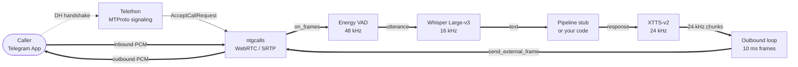

#p2p-offline-ai-telegram-bridge

A locally running, offline AI – reachable via Telegram voice call (pure voice bridge, no bot). It answers calls, detects motion at the door and sends a live image – all deterministic, on own hardware, without cloud.


[](LICENSE)
[](https://www.python.org/)
[]()
[]()
[]()

Low-level integration of Telegram P2P voice calls with external PCM audio sources. Built directly on Telethon (MTProto signaling) and ntgcalls (WebRTC transport) — no high-level wrappers.

> **License: AGPL-3.0.** If you build this bridge into a network-accessible service, your service source must be published under the same license, with NovaMind Studios credited as the source. Details in the [License](#license) section.

---

## What this is

A working proof-of-concept for handling **private 1-on-1 Telegram voice calls** with raw PCM access in both directions. The high-level wrapper `py-tgcalls` does not expose private calls or raw audio callbacks for 1-on-1 sessions in its stable release, so this project bypasses it and uses ntgcalls' native pybind11 bindings directly.

Default pipeline: inbound PCM is routed through VAD and Whisper, response text is generated by a local pipeline (echo stub or a local Ollama model), and XTTS-v2 synthesises outbound PCM back into the call. Both directions work — the decisive detail is the call-setup ordering, see the inbound-audio note below.

---

## Current status (July 2026)

| Component | Status |
|---|---|
| Auto-answer (UpdatePhoneCall + AcceptCallRequest) | ✅ Working |
| DH key exchange (Telethon ↔ ntgcalls) | ✅ Working |
| WebRTC P2P connection (CONNECTED state) | ✅ Working |
| Bidirectional MTProto signaling relay | ✅ Working |
| **Outbound audio** (`send_external_frame`, XTTS synthesis) | ✅ Working |
| **Inbound audio** (`on_frames`, caller's voice → Whisper) | ✅ Working — requires the call-setup ordering below |
| Clean call teardown (no lingering process, verified) | ✅ Working |
| Out-of-process call worker (process isolation) | ✅ Working |

**About inbound audio and [ntgcalls#44](https://github.com/pytgcalls/ntgcalls/issues/44):** with the naive setup order, ntgcalls 2.1.0 delivers no `on_frames` callbacks for private 1-on-1 P2P calls — that dead end is what the upstream issue describes. It turns out to be avoidable with unmodified ntgcalls 2.1.0 by getting the call-setup sequence right, which this repo implements: set the CAPTURE stream source immediately after `create_p2p_call` (before the key exchange), set the PLAYBACK stream source only **after** `connect_p2p` (on the `microphone` slot — inbound frames arrive as `device=MICROPHONE, mode=PLAYBACK`), then `unmute` + `resume`, and keep a continuous outbound frame stream (silence when idle). With that ordering, inbound frames flow and Whisper transcribes the caller. Verified in daily use in the system this bridge was extracted from.

**Note on XTTS speech-out:** use XTTS `inference()`, not `inference_stream()` — the streaming path is broken with `transformers` 4.46.3 (it raises `'int' object has no attribute 'device'`). The non-streaming call works and the outbound loop paces the result into 10 ms frames.

**Fixed: lingering call process (July 2026).** Problem: after a call ended, the process hosting ntgcalls kept running with roughly 2 GB of memory still allocated. Cause: the native ntgcalls/WebRTC transport does not fully release its resources inside the host process after teardown. Fix: the call transport now runs in a dedicated out-of-process worker that is terminated when the call ends, which guarantees complete resource release — verified over repeated calls in both directions with zero leftover processes. The worker implementation lives in the integrating system, not in this proof-of-concept repository; it is a teardown/cleanup mechanism and is **not** required for inbound audio.

## Scope

This project does:

- Auto-answer Telegram P2P voice calls
- Stream synthesised audio into the call (outbound)
- Receive the caller's voice and transcribe it locally with Whisper (inbound)
- Provide a verified raw-PCM I/O contract for ntgcalls 2.1.0
- Offer a clean integration point for any local STT / LLM / TTS pipeline

This project does NOT:

- Record, store or relay any conversation content
- Bypass any Telegram security mechanism
- Operate as a mass-call, autodial or spam tool
- Require any cloud service for the audio pipeline

---

## Architecture


```mermaid
flowchart LR
    Caller([Caller<br/>Telegram App])
    Tele[Telethon<br/>MTProto signaling]
    NTG[ntgcalls<br/>WebRTC / SRTP]
    VAD[Energy VAD<br/>48 kHz]
    STT[Whisper Large-v3<br/>16 kHz]
    PIPE[Pipeline stub<br/>or your code]
    TTS[XTTS-v2<br/>24 kHz]
    OUT[Outbound loop<br/>10 ms frames]

    Caller -.->|DH handshake| Tele
    Tele -->|AcceptCallRequest| NTG
    Caller ==>|inbound PCM| NTG
    NTG ==>|on_frames| VAD
    VAD ==>|utterance| STT
    STT ==>|text| PIPE
    PIPE ==>|response| TTS
    TTS ==>|24 kHz chunks| OUT
    OUT ==>|send_external_frame| NTG
    NTG ==>|outbound PCM| Caller
```

| Layer | Library | Responsibility |
|---|---|---|
| Signaling | Telethon | MTProto, DH key exchange, call accept/discard, signaling relay |
| Transport | ntgcalls 2.1.0 | WebRTC/SRTP, raw PCM I/O, RTC server negotiation |
| Speech-in | faster-whisper | Transcription, 16 kHz |
| Speech-out | Coqui TTS (XTTS-v2) | Synthesis with voice cloning, 24 kHz |
| VAD | Energy-based (built-in) | Replace with silero-vad for production |

---

## Requirements

- Windows x86_64
- NVIDIA GPU with CUDA 12.1 (tested on RTX 3070, 8 GB VRAM)
- Python 3.10 or newer
- Telegram account with `api_id` / `api_hash` from [my.telegram.org/apps](https://my.telegram.org/apps)

---

## Install

The install order matters. `pip install -r requirements.txt` alone will let Coqui TTS pull its own torch wheel and silently downgrade your CUDA build. Follow these steps in order.

```bash
python -m pip install --upgrade pip setuptools wheel

pip install torch==2.5.1+cu121 torchaudio==2.5.1+cu121 \
    --index-url https://download.pytorch.org/whl/cu121

pip install ntgcalls==2.1.0 --no-deps
pip install "Telethon>=1.36.0,<2.0.0" cryptg --no-deps

pip install "faster-whisper>=1.0.0,<2.0.0" "numpy>=1.26.0,<2.0.0" "scipy>=1.13.0,<2.0.0" "soundfile>=0.12.1,<1.0.0"

# transformers must be pinned - TTS is installed --no-deps below, and newer
# transformers breaks XTTS synthesis ('int' object has no attribute 'device').
pip install transformers==4.46.3
pip install TTS==0.22.0 --no-deps
```

> **Why `--no-deps` everywhere:** Coqui TTS, faster-whisper and ntgcalls all declare loose torch dependencies. Without `--no-deps`, pip will silently downgrade your CUDA-enabled torch to the CPU build, breaking GPU inference. This is not optional on Windows + CUDA 12.1.

---

## Configuration

```bash
cp config.example.json config.json
```

Edit `config.json` with your Telegram `api_id`, `api_hash`, phone number, and a path to a 6–30 second WAV speaker reference for XTTS voice cloning.

---

## Run

```bash
python nova_voice_call.py
```

On first run, Telethon will prompt for the SMS code Telegram sends to your phone. The session is then cached. Once running, any incoming voice call to the configured account is auto-accepted and answered by the pipeline.

---

## Audio specifications

| Parameter | Value |
|---|---|
| Call sample rate | 48 000 Hz |
| Channels | mono |
| Frame size | 480 samples (10 ms) |
| Frame bytes | 960 bytes (int16 LE) |
| Sample format | PCM int16 little-endian |
| Whisper sample rate | 16 000 Hz (resampled internally) |
| XTTS sample rate | 24 000 Hz (resampled to 48 kHz before send) |

> **Note on frame size:** ntgcalls 2.1.0 `AudioSink.frameTime()` is **10 ms**, not 20 ms (a common misconception). Sending 20 ms frames causes jitter buffer underruns. Verified against `ntgcalls/src/media/audio_sink.cpp`.

---

## Custom pipeline

**This bridge is the telephony layer — the "brain" is swappable.** Bring your own offline model: anything with a `process(text) -> text` interface plugs in. The default `EchoPipeline` just repeats what you said; `OllamaPipeline` (below) connects a real local LLM.

Replace `EchoPipeline` in `nova_voice_call.py` with your own logic:

```python
class MyPipeline:
    def process(self, text: str) -> str:
        return your_logic(text)
```

The pipeline runs in a thread pool — non-blocking with respect to the audio I/O thread.

---

## Test it with your own offline model (Ollama)

### Before you start — what you actually need

- A Windows PC with an NVIDIA graphics card, ~8 GB VRAM (tested on RTX 3070). The voice models are heavy. This will not run on a normal laptop, and not on a Mac.
- **Two Telegram accounts.** One runs the bridge (the one being called), one calls from. You cannot easily call yourself.
- **Do not use your main Telegram account for the bridge.** Use a spare account with a second SIM. Auto-answering user accounts can get flagged by Telegram.
- **A BotFather bot will not work.** Telegram bots cannot make or receive voice calls at all — the bot system has no calling. This project logs in as a real user account.

### Step 1 — Install Telegram and set up a spare account

Install Telegram on your phone with a second SIM / spare number. This account will run the bridge.

### Step 2 — Get your API credentials

Go to `my.telegram.org/apps`, log in with the spare account's number, and create an app. Note down `api_id` and `api_hash`.

### Step 3 — Install Python 3.10 or newer

From python.org. During installation, tick "Add Python to PATH".

### Step 4 — Download this repository

Green "Code" button → "Download ZIP" → unpack it. Or, with Git installed:

```
git clone https://github.com/TxPKev/ari-telegram-voice.git
cd ari-telegram-voice
```

### Step 5 — Install the Python packages, in exactly this order

Order matters. Installing them any other way lets Coqui TTS silently replace your GPU-enabled torch with the CPU version, and nothing will work.

```
python -m pip install --upgrade pip setuptools wheel

pip install torch==2.5.1+cu121 torchaudio==2.5.1+cu121 --index-url https://download.pytorch.org/whl/cu121

pip install ntgcalls==2.1.0 --no-deps
pip install "Telethon>=1.36.0,<2.0.0" cryptg --no-deps
pip install "faster-whisper>=1.0.0,<2.0.0" "numpy>=1.26.0,<2.0.0" "scipy>=1.13.0,<2.0.0" "soundfile>=0.12.1,<1.0.0"
pip install transformers==4.46.3
pip install TTS==0.22.0 --no-deps
```

Pin `transformers==4.46.3` — a newer version makes XTTS crash with `'int' object has no attribute 'device'`.

### Step 6 — Install Ollama and pull a model

Download Ollama from `ollama.com`, install it, then in a terminal:

```
ollama pull qwen2.5:3b
```

Leave Ollama running in the background.

### Step 7 — Create your config file

Copy `config.example.json` to `config.json` and open it in a text editor. Fill in:

- `api_id` and `api_hash` from Step 2
- your spare account's `phone` number, with country code
- `speaker_wav`: path to a 6–30 second WAV recording of a voice — this is the voice the AI will speak with
- `pipeline`: change from `"echo"` to `"ollama"`
- `ollama_model`: `"qwen2.5:3b"`

### Step 8 — Start it

```
python nova_voice_call.py
```

On the first run, Telegram sends an SMS code to the spare number. Enter it. The session is cached afterwards, so this only happens once.

### Step 9 — Call it

From your other Telegram account, place a normal Telegram voice call to the spare account. The bridge answers automatically and the AI speaks.

### What works and what doesn't

Both directions work: the AI hears you (your speech is transcribed locally by Whisper) and talks back. If the call connects but the AI does not react to your voice, check the log for `Connection state: CONNECTED` and `[VAD] Utterance detected` lines — and speak clearly for at least a second; very short fragments are ignored on purpose. Known rough edge: occasionally an utterance yields an empty transcription; the bridge stays silent in that case instead of guessing.

---

## License

**AGPL-3.0** — see [LICENSE](LICENSE). This is a strong copyleft license, and it is the condition for using this code:

- If you integrate this bridge into any **network-accessible service** (a bot, a hosted assistant, a call gateway), you must make **your own service's source code** available under AGPL-3.0 as well.
- You must retain the license and attribute **NovaMind Studios** as the source of the bridge.
- There is no closed-source or proprietary use of this bridge in networked services — if you need different terms, contact the address below.

---

NovaMind Studios — Niedergösgen, Switzerland  
ki27@ik.me  
[txpkev.github.io/NOVAMINDSTUDIO](https://txpkev.github.io/novamindstudio)
