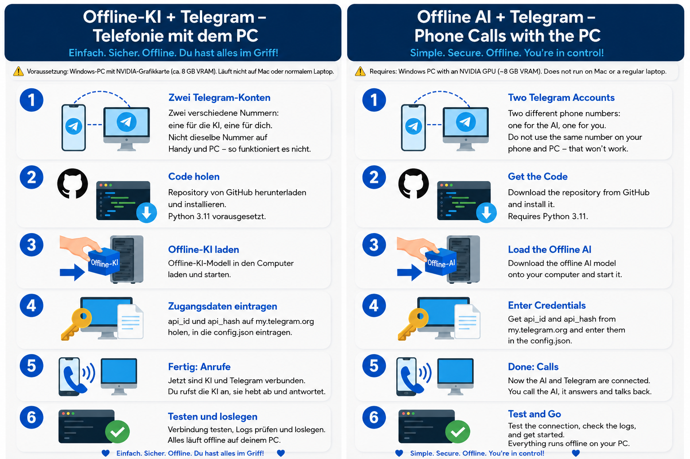

# p2p-offline-ai-telegram-bridge

A locally running AI you can phone. Telegram voice call in, synthesised speech out — a pure voice bridge, not a bot. It answers, hears you and talks back, entirely on your own hardware, with no cloud service anywhere in the audio path.


Low-level integration of Telegram P2P voice calls with external PCM audio sources. Built directly on Telethon (MTProto signaling) and ntgcalls (WebRTC transport) — no high-level wrappers.

> **License: AGPL-3.0.** If you build this bridge into a network-accessible service, your service source must be published under the same license, with NovaMind Studio credited as the source. Details in the [License](#license) section.

---

## Where this comes from

This is not a weekend demo. It is the telephony layer of a larger offline system that has been in daily use for months, extracted so that it runs on its own with no dependency on the rest of that system.

That matters for two reasons. Every filled-in figure in the table below was measured on live calls on the hardware listed — not estimated, not copied from documentation. And the ntgcalls facts in `audio_loop.py` — the 10 ms frame timing, the `on_frames` callback signature — were taken from the ntgcalls C++ source rather than found by trial and error; the file cites the source file for each, so you can check them yourself.

**What "deterministic" means here, precisely.** It refers to the transport path, not the content: a fixed frame size (960 bytes at 48 kHz mono), a fixed sample rate, and one single route through the pipeline. The same call takes the same path every time, and every stage leaves a trace in the log. It does **not** mean the output is bit-identical — XTTS samples when it synthesises, so the exact waveform varies from call to call — nor that the system always understands you. And a language model plugged in as the brain (the Ollama option below) is not deterministic at all. The plumbing is fixed; the voice and the brain are your choice, and neither of them is.

### Measured

| Stage | Measured | Conditions |
|---|---|---|
| Speech in to voice out, round trip | — | not yet measured rigorously |
| Speech recognition | ~0.7–1.6 s per utterance | faster-whisper large-v3, RTX 3070 |
| Voice synthesis, first audio out | ~0.9–2.3 s | XTTS-v2, RTX 3070, varies with sentence length |
| Continuous call, leftover processes | 0 | verified over repeated calls, both directions |

These are honest figures for Whisper large-v3 and XTTS-v2 on an 8 GB card, not a marketing "near-instant". In a live call the recognition-plus-synthesis gap is a noticeable pause; if you want less latency at the cost of some accuracy, a smaller Whisper model (`medium` / `small`) cuts the recognition time.

Hardware: NVIDIA RTX 3070 (8 GB VRAM), Windows x64, CUDA 12.1, Python 3.11.

Built by **NovaMind Studio**, Switzerland.

---

## Offline AI + Telegram — quickstart (German / English)



**Setup in short:** get your `api_id` and `api_hash` from [my.telegram.org/apps](https://my.telegram.org/apps), put them into `config.json`, then follow the step-by-step guide below. You call the AI's Telegram number, it answers and talks back.

---

## What this is

A working proof-of-concept for handling private 1-on-1 Telegram voice calls with raw PCM access in both directions. The high-level wrapper `py-tgcalls` does not expose private calls or raw audio callbacks for 1-on-1 sessions in its stable release, so this project bypasses it and uses ntgcalls' native pybind11 bindings directly.

Default pipeline: inbound PCM is routed through VAD and Whisper, response text is generated by a local pipeline (echo stub or a local Ollama model), and XTTS-v2 synthesises outbound PCM back into the call. Both directions work — the decisive detail is the call-setup ordering, see the inbound-audio note below.

---

## Current status (July 2026)

| Component | Status |
|---|---|
| Auto-answer (UpdatePhoneCall + AcceptCallRequest) | ✅ Working |
| DH key exchange (Telethon ↔ ntgcalls) | ✅ Working |
| WebRTC P2P connection (CONNECTED state) | ✅ Working |
| Bidirectional MTProto signaling relay | ✅ Working |
| Outbound audio (send_external_frame, XTTS synthesis) | ✅ Working |
| Inbound audio (on_frames, caller's voice → Whisper) | ✅ Working — requires the call-setup ordering below |
| Clean call teardown (no lingering process, verified) | ✅ Working |
| Out-of-process call worker (process isolation) | ✅ Working |

### Inbound audio — the call-setup ordering

Inbound audio works with **unmodified ntgcalls 2.1.0**. The decisive detail is the order of the setup calls:

1. `create_p2p_call`
2. set the **CAPTURE** stream source immediately after, before the key exchange
3. `connect_p2p`
4. set the **PLAYBACK** stream source only now, on the **microphone slot** — inbound frames arrive as `device=MICROPHONE`, `mode=PLAYBACK`
5. `unmute`
6. `resume`

And keep a **continuous outbound frame stream** running throughout, silence frames when idle. If the outbound side goes quiet, the return path never opens.

With that ordering, `on_frames` delivers the caller's audio and Whisper transcribes it — verified in daily use in the system this bridge was extracted from.

With the naive setup order, ntgcalls 2.1.0 delivers no `on_frames` callbacks at all for private 1-on-1 P2P calls; get the sequence right and it does. ([ntgcalls#44](https://github.com/pytgcalls/ntgcalls/issues/44) reports a related but *opposite* symptom — **outbound** audio staying silent, sender-side, because the network state is never raised — where the continuous outbound stream above may also play a part. Our problem was the inbound direction.)

**Note on XTTS speech-out:** this project uses XTTS `inference()`, not `inference_stream()`. On the original `TTS==0.22.0` with `transformers 4.46.3` the streaming path raises `'int' object has no attribute 'device'`; the non-streaming call works, and the outbound loop paces the result into 10 ms frames anyway. That is still what the code does on the current `coqui-tts` install (verified end to end on a clean machine).

**Fixed: lingering call process (July 2026).** After a call ended, the process hosting ntgcalls kept running with roughly 2 GB of memory still allocated. Cause: the native ntgcalls/WebRTC transport does not fully release its resources inside the host process after teardown. Fix: the call transport now runs in a dedicated out-of-process worker that is terminated when the call ends, which guarantees complete resource release — verified over repeated calls in both directions with zero leftover processes. The worker implementation lives in the integrating system, not in this proof-of-concept repository; it is a teardown/cleanup mechanism and is not required for inbound audio.

**If you isolate ntgcalls in a child process, make its death visible.** Putting the call transport in a separate process is a sound way to contain a native fault — we verified with a stand-in child that dies natively (segfault and `abort`) that the parent survives every time and keeps running. But containment is not detection, and the obvious wiring hides the failure in two ways:

- **Drain the child's stderr, or don't pipe it.** If you open `stderr=PIPE` and never read it, a crashing or chatty child fills the OS buffer and blocks there forever. The parent still holds a live process handle and considers the child healthy — you get a silent hang instead of a crash.
- **Read the exit code, not just "is it gone".** `poll() is not None` tells you the child ended, not *how* it ended. A native fault exits with a distinctive status (on Windows e.g. `0xC0000409`, on POSIX a signal). If your teardown logs "worker stopped" unconditionally, a segfault and a clean shutdown produce the identical line — and you will chase the wrong bug for weeks.

Also arm `faulthandler` inside the child and point it at a file. A native fault then leaves a stack trace behind instead of silence.

---

## Scope

**This project does:**

- Auto-answer Telegram P2P voice calls
- Stream synthesised audio into the call (outbound)
- Receive the caller's voice and transcribe it locally with Whisper (inbound)
- Provide a verified raw-PCM I/O contract for ntgcalls 2.1.0
- Offer a clean integration point for any local STT / LLM / TTS pipeline

**This project does NOT:**

- Record, store or relay any conversation content
- Bypass any Telegram security mechanism
- Operate as a mass-call, autodial or spam tool
- Require any cloud service for the audio pipeline

---

## Architecture

| Layer | Library | Responsibility |
|---|---|---|
| Signaling | Telethon | MTProto, DH key exchange, call accept/discard, signaling relay |
| Transport | ntgcalls 2.1.0 | WebRTC/SRTP, raw PCM I/O, RTC server negotiation |
| Speech-in | faster-whisper | Transcription, 16 kHz |
| Speech-out | Coqui TTS (XTTS-v2) | Synthesis with voice cloning, 24 kHz |
| VAD | Energy-based (built-in) | Replace with silero-vad for production |

---

## Requirements

- Windows x86_64
- NVIDIA GPU with CUDA 12.1 (tested on RTX 3070, 8 GB VRAM)
- Tested on Python 3.11 (newer versions likely work; 3.11 is what this was verified on)
- Telegram account with `api_id` / `api_hash` from [my.telegram.org/apps](https://my.telegram.org/apps)

---

## Install

> ⚠️ **Install this into a fresh, dedicated virtual environment.** Do not run these commands inside an existing environment that already has a working XTTS setup. They move `transformers` and replace the TTS package — a voice tuned and A/B-tested against `TTS==0.22.0` + `transformers==4.46.3` will not sound identical afterwards, and any stored voice parameters become meaningless. This bridge is standalone; give it its own venv.

**The install order matters, and the steps below are the ones that were actually run on a clean machine.** Follow them in order.

Put the project in a **short path** (e.g. `C:\bridge`). Torch ships files with very long names; installed under a deep path, Windows aborts with `No such file or directory: ...torch\include\ATen\ops\...`.

```bash
python -m pip install --upgrade pip "setuptools<81" wheel

pip install torch==2.5.1+cu121 torchaudio==2.5.1+cu121 \
    --index-url https://download.pytorch.org/whl/cu121

pip install ntgcalls==2.1.0 --no-deps

pip install -c constraints.txt "Telethon>=1.36.0,<2.0.0" cryptg

pip install -c constraints.txt "faster-whisper==1.1.1" "ctranslate2==4.6.0" \
    "numpy>=1.26.0,<2.0.0" "scipy>=1.13.0,<2.0.0" "soundfile>=0.12.1,<1.0.0"

pip install -c constraints.txt coqui-tts==0.27.5
```

**Why `constraints.txt` and not `--no-deps` everywhere.** `--no-deps` was originally used to stop pip resolving a CPU torch over the CUDA build — a real danger, but the wrong tool: it also strips the dependencies a package genuinely needs. Telethon then lacks `pyaes` and `rsa`; the archived `TTS` package lacked 39 others.

`coqui-tts` 0.27.5 no longer declares PyTorch as a dependency at all (that changed in 0.27.4), but it does declare `transformers`, `numpy` and `scipy` — and pip is free to move those while resolving. Each one breaks something here if it moves: transformers 5.x removed `isin_mps_friendly`, numpy 2.x breaks the pinned ctranslate2. [constraints.txt](constraints.txt) lets pip install what every package genuinely needs while forbidding it to touch these. torch and torchaudio stay in the list as a safety net for older or future versions that do declare them. `--no-deps` remains on `ntgcalls` alone, which really has no dependencies.

Four things that only bite on a *fresh* machine, all of them fixed above:

- **`setuptools<81`** — newer setuptools dropped `pkg_resources`, which `ctranslate2` imports on startup. Without the pin, speech recognition fails to import and this project reports the misleading `Neither faster-whisper nor openai-whisper is installed`.
- **`faster-whisper` pinned to 1.1.1 / `ctranslate2` 4.6.0** — 1.2.x pulls ctranslate2 4.8, whose cuDNN clashes with this torch build (`Could not load symbol cudnnGetLibConfig`).
- **`coqui-tts==0.27.5` instead of `TTS==0.22.0`** — the archived `TTS` package has no wheel for Windows/Python 3.11, and its dependency `pyworld` has to be built from source, so every user first had to install MS Build Tools. `coqui-tts` is the maintained fork; it does not pull `pyworld` at all (verified: absent from the working environment), and every remaining dependency installs from a wheel. **No compiler is needed** — that is not a workaround, the requirement is gone.
- **transformers `>=4.47,<5`** (in constraints.txt) — coqui-tts needs `isin_mps_friendly`, added in 4.47; transformers 5.x removed it again.

---

## Configuration

```bash
cp config.example.json config.json
```

Edit `config.json` with:

- `api_id` and `api_hash` from [my.telegram.org/apps](https://my.telegram.org/apps)
- your `phone` number, with country code
- `speaker_wav`: path to a 6–30 second WAV speaker reference for XTTS voice cloning
- `pipeline`: `"echo"` (default stub) or `"ollama"` (local LLM)
- `ollama_model`: the model tag to use, e.g. `"qwen2.5:3b"`

---

## Run

```bash
python nova_voice_call.py
```

On first run, Telethon will prompt for the SMS code Telegram sends to your phone. The session is then cached. Once running, any incoming voice call to the configured account is auto-accepted and answered by the pipeline.

---

## Audio specifications

| Parameter | Value |
|---|---|
| Call sample rate | 48 000 Hz |
| Channels | mono |
| Frame size | 480 samples (10 ms) |
| Frame bytes | 960 bytes (int16 LE) |
| Sample format | PCM int16 little-endian |
| Whisper sample rate | 16 000 Hz (resampled internally) |
| XTTS sample rate | 24 000 Hz (resampled to 48 kHz before send) |

**Note on frame size:** ntgcalls 2.1.0 `AudioSink.frameTime()` is 10 ms, not 20 ms (a common misconception). Sending 20 ms frames causes jitter buffer underruns. Verified against `ntgcalls/src/media/audio_sink.cpp`.

---

## Custom pipeline

This bridge is the telephony layer — the "brain" is swappable and deliberately kept out of this repository. Bring your own offline model: anything with a `process(text) -> text` interface plugs in. The default `EchoPipeline` just repeats what you said; `OllamaPipeline` (below) connects a real local LLM as a working example.

Replace `EchoPipeline` in `nova_voice_call.py` with your own logic:

```python
class MyPipeline:
    def process(self, text: str) -> str:
        return your_logic(text)
```

The pipeline runs in a thread pool — non-blocking with respect to the audio I/O thread.

---

## Test it with your own offline model (Ollama)

### Before you start — what you actually need

- **A Windows PC with an NVIDIA graphics card, ~8 GB VRAM** (tested on RTX 3070). The voice models are heavy. This will not run on a normal laptop, and not on a Mac.
- **Two Telegram accounts.** One runs the bridge (the one being called), one calls from. You cannot easily call yourself.
- **Do not use your main Telegram account for the bridge.** Use a spare account with a second SIM. Auto-answering user accounts can get flagged by Telegram.
- **A BotFather bot will not work.** Telegram bots cannot make or receive voice calls at all — the bot system has no calling. This project logs in as a real user account.

### Step 1 — Install Telegram and set up a spare account

Install Telegram on your phone with a second SIM / spare number. This account will run the bridge.

### Step 2 — Get your API credentials

Go to [my.telegram.org/apps](https://my.telegram.org/apps), log in with the spare account's number, and create an app. Note down `api_id` and `api_hash`.

### Step 3 — Install Python (tested on 3.11)

From [python.org](https://www.python.org/downloads/). During installation, tick **"Add Python to PATH"**.

### Step 4 — Download this repository

Green **"Code"** button → **"Download ZIP"** → unpack it. Or, with Git installed:

```bash
git clone https://github.com/TxPKev/p2p-offline-ai-telegram-bridge.git
cd p2p-offline-ai-telegram-bridge
```

### Step 5 — Install the Python packages, in exactly this order

Order matters. Installing them any other way lets pip replace your GPU-enabled torch with the CPU version, and nothing will work. Unpack the project into a **short path** like `C:\bridge` — torch has very long filenames and a deep path makes the install fail on Windows.

Create a **fresh virtual environment for the bridge** and install into that one — never into an environment that already runs a tuned XTTS setup (these packages change how XTTS sounds):

```bash
python -m venv venv
venv\Scripts\activate
```

```bash
python -m pip install --upgrade pip "setuptools<81" wheel
pip install torch==2.5.1+cu121 torchaudio==2.5.1+cu121 --index-url https://download.pytorch.org/whl/cu121
pip install ntgcalls==2.1.0 --no-deps
pip install -c constraints.txt "Telethon>=1.36.0,<2.0.0" cryptg
pip install -c constraints.txt "faster-whisper==1.1.1" "ctranslate2==4.6.0" "numpy>=1.26.0,<2.0.0" "scipy>=1.13.0,<2.0.0" "soundfile>=0.12.1,<1.0.0"
pip install -c constraints.txt coqui-tts==0.27.5
```

`constraints.txt` comes with the repository — it stops pip from replacing torch while it resolves the other packages. **No C++ compiler is needed**; the exact commands above were run on a clean machine and produced working speech.

### Step 6 — Install Ollama and pull a model

Download Ollama from [ollama.com](https://ollama.com), install it, then in a terminal:

```bash
ollama pull qwen2.5:3b
```

Leave Ollama running in the background.

This is an example brain, not the point of the project. Any local model with a `process(text) -> text` interface works just as well — see [Custom pipeline](#custom-pipeline).

### Step 7 — Create your config file

Copy `config.example.json` to `config.json` and open it in a text editor. Fill in:

- `api_id` and `api_hash` from Step 2
- your spare account's phone number, with country code
- `speaker_wav`: path to a 6–30 second WAV recording of a voice — this is the voice the AI will speak with
- `pipeline`: change from `"echo"` to `"ollama"`
- `ollama_model`: `"qwen2.5:3b"`

### Step 8 — Start it

```bash
python nova_voice_call.py
```

On the first run, Telegram sends an SMS code to the spare number. Enter it. The session is cached afterwards, so this only happens once.

### Step 9 — Call it

From your other Telegram account, place a normal Telegram voice call to the spare account. The bridge answers automatically and the AI speaks.

### What works and what doesn't

Both directions work: the AI hears you (your speech is transcribed locally by Whisper) and talks back.

If the call connects but the AI does not react to your voice, check the log for `Connection state: CONNECTED` and `[VAD] Utterance detected` lines — and speak clearly for at least a second; very short fragments are ignored on purpose.

Known rough edge: occasionally an utterance yields an empty transcription; the bridge stays silent in that case instead of guessing.

---

## Reporting problems

This was verified on the hardware listed above. On different hardware it will behave differently — that has already been demonstrated once by an external tester who found four startup failures that a syntax check had happily passed.

If it fails on your setup, open an issue with your GPU, your CUDA version, your Python version and the log output. Reports get fixed.

---

## License

**AGPL-3.0** — see [LICENSE](LICENSE). This is a strong copyleft license, and it is the condition for using this code:

- If you integrate this bridge into any **network-accessible service** (a bot, a hosted assistant, a call gateway), you must make **your own service's source code** available under AGPL-3.0 as well.
- You must retain the license and attribute **NovaMind Studio** as the source of the bridge.
- There is no closed-source or proprietary use of this bridge in networked services — if you need different terms, contact the address below.

---

NovaMind Studio — Niedergösgen, Switzerland  
ki27@ik.me  
[txpkev.github.io/novamindstudio](https://txpkev.github.io/novamindstudio)
